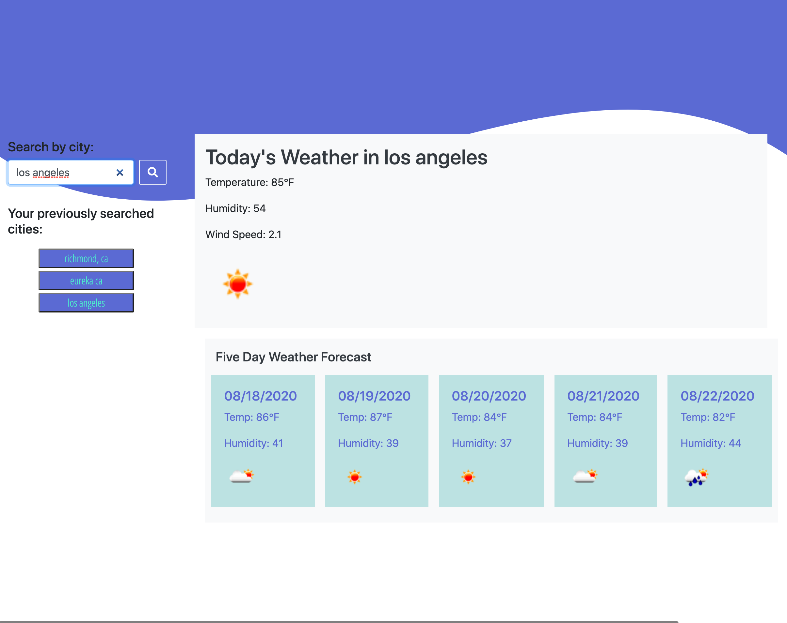

# Weather Dashboard

## About

Basic Dash App to retrieve city weather forecast pullin from open weather api

After the user types in a city name, that city is automatically loaded into the user's search history through local storage.
live:
https://reverbdesigns.github.io/weather_dash/
git:
https://github.com/ReverbDesigns/weather_dash.git
## Coding
This app uses HTML, CSS, some svg elements (with Bootstrap elements), JavaScript, JQuery, and the OpenWeatherSource API, for two discinct API calls. 
